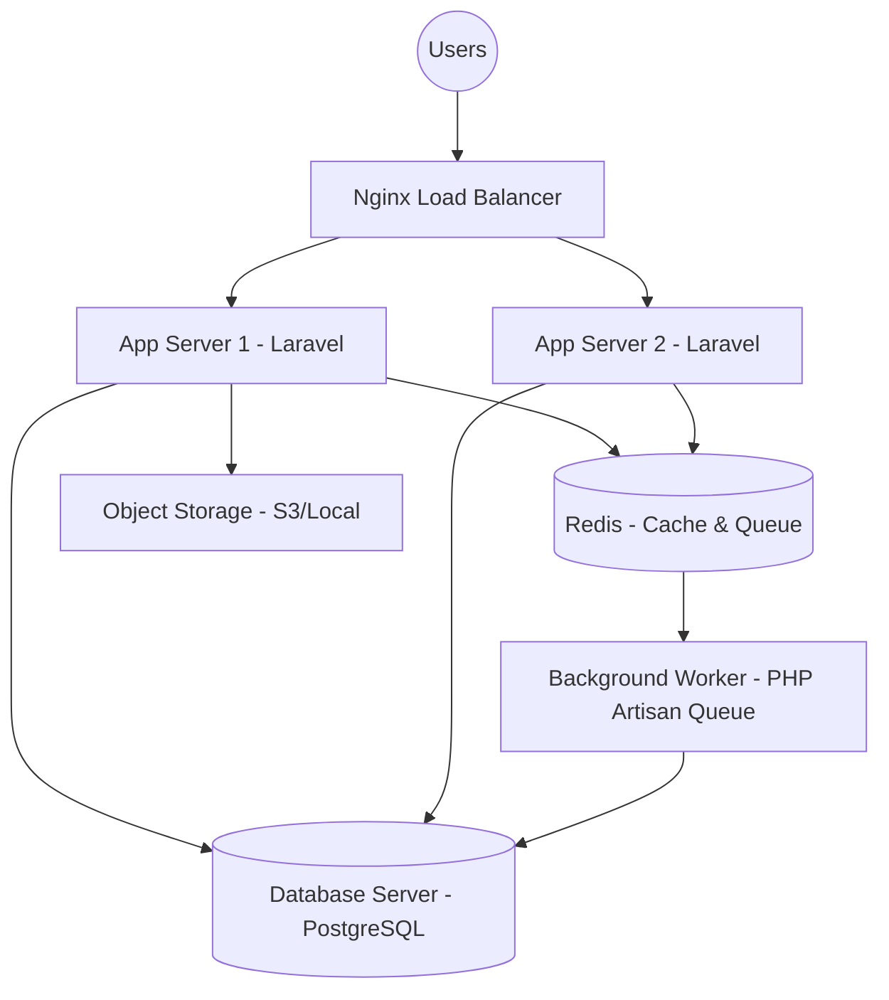

# Arsitektur Perangkat Keras & Infrastruktur - SmartStock Pro

## 1. Topologi Infrastruktur
Sistem SmartStock Pro dirancang menggunakan arsitektur modular yang memisahkan layer aplikasi, database, dan pemrosesan antrian.

## 2. Spesifikasi Server Minimum (Rekomendasi)

### A. Web/App Server
- **Prosesor:** Intel Xeon / AMD EPYC (Minimal 2 Core vCPU)
- **RAM:** 4 GB DDR4
- **Penyimpanan:** 40 GB SSD (NVMe direkomendasikan)
- **Bandwidth:** 100 Mbps Shared

### B. Database Server (Dedicated)
- **Prosesor:** Minimal 4 Core vCPU
- **RAM:** 8 GB DDR4
- **Penyimpanan:** 100 GB SSD (RAID 10 direkomendasikan)

## 3. Analisis Skalabilitas
- **Vertical Scaling:** Meningkatkan CPU/RAM pada server tunggal jika pengguna meningkat hingga 500 orang.
- **Horizontal Scaling:** Menambah instance App Server di belakang Load Balancer jika trafik melampaui kapasitas server tunggal.
- **Queue Separation:** Memisahkan worker ke server terpisah untuk menangani import data masif (CSV/Excel) tanpa membebani UI.

## 4. Strategi Backup
- **Daily Snapshot:** Backup seluruh disk server setiap pukul 02:00 pagi.
- **Database Dump:** Export SQL harian yang disimpan di Object Storage terpisah.
